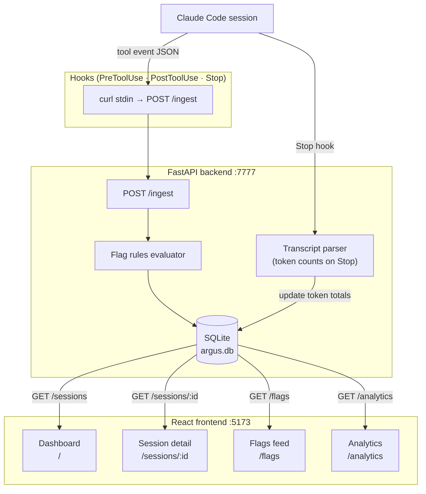

# Argus

## What is this?

You're using Claude Code to help build your project. It works fast, solves things you'd spend hours on, and drops finished code into your repo. But here's the honest question: **do you actually know what it did?** What files did it touch? What commands did it run? How much did it cost? If something went wrong, could you trace back exactly where?

Argus is a dashboard that answers these questions. Every time your AI agent takes an action — reads a file, writes code, runs bash, spawns a subagent — Argus captures it, stores it, and shows it to you in a live trace tree. You get a clear timeline of what happened, when it happened, and what it cost. You also get instant alerts on anything suspicious (like a command trying to `rm -rf` your drive, or a file being written outside your project).

It's local-first — your data never leaves your machine. No cloud uploads. No sending your code to some observability startup. Just a lightweight SQLite database on your computer and a React dashboard you visit in your browser.

Argus is built for developers using Claude Code who want to know exactly what their AI did, why, and what it cost.

## Why

Claude Code runs on your machine, touches your files, and executes commands. Existing LLM observability tools assume cloud API calls. Argus owns the local/agentic niche: the security surface is highest there, and visibility is currently zero.

## How it works



## Architecture

### Event ingestion

Claude Code fires a hook on every tool use. The hook script reads the event JSON from stdin and POSTs it to `localhost:7777/ingest`. The backend evaluates flag rules and writes to SQLite immediately.

### Data model

```
Session
├── id (Claude Code session uuid)
├── project_path
├── started_at / ended_at
├── total_cost_usd
├── status: active | completed | interrupted
└── parent_session_id  ← set for subagent sessions

Event
├── id
├── session_id (FK)
├── type: tool_call | tool_result | subagent_spawn | compaction | error
├── tool_name, tool_input, tool_output (JSON)
├── input_tokens, output_tokens, cost_usd, duration_ms
├── flagged, flag_reason
└── timestamp
```

### Flag rules

| Pattern | Severity |
|---|---|
| Bash: `sudo`, `rm -rf`, `curl \| bash`, `chmod 777` | warning / critical |
| Write outside project directory | warning |
| Subagent with no parent session | info |
| Single event cost > $0.10 | warning |
| Session cost > $1.00 | warning |

### Frontend pages

```
/                   Dashboard — session list, summary stats (cost, tokens, flags)
/sessions/:id       Trace tree (agent → subagents → tool calls) + event timeline
/flags              Security feed — all flagged events with reason and severity
/analytics          Usage Analytics — bar charts for top tools, hooks, agents, skills, bash commands
```

## Stack

| Layer | Technology |
|---|---|
| Event capture | Claude Code hooks (PreToolUse, PostToolUse, Stop) |
| Storage | SQLite via SQLModel |
| Backend | FastAPI |
| Frontend | React + Tailwind + Vite |
| Charts | Recharts |

## Quickstart

```bash
# Backend
cd backend
pip install fastapi uvicorn sqlmodel
uvicorn main:app --port 7777 --reload

# Frontend (separate terminal)
cd frontend
npm install
npm run dev
```

Then register hooks in your `~/.claude/settings.json` — see [CLAUDE.md](CLAUDE.md) for the exact snippet.
