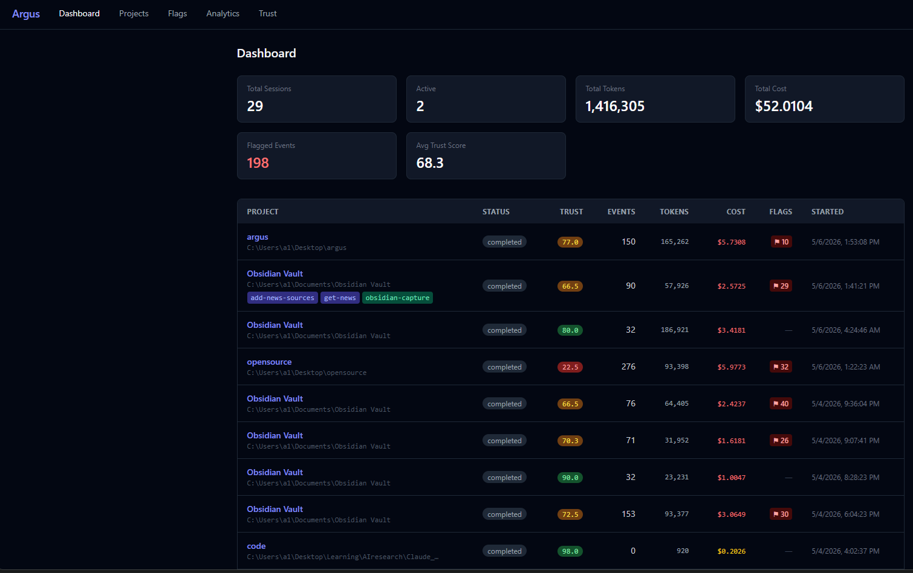
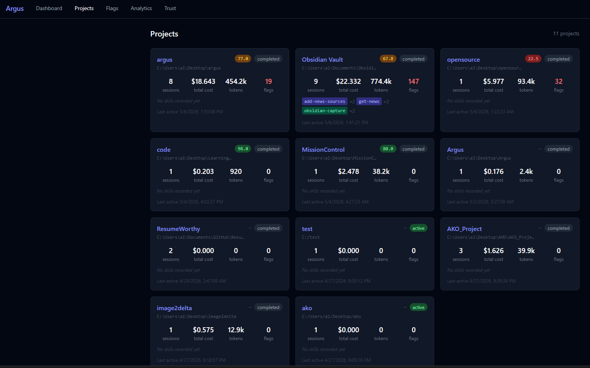
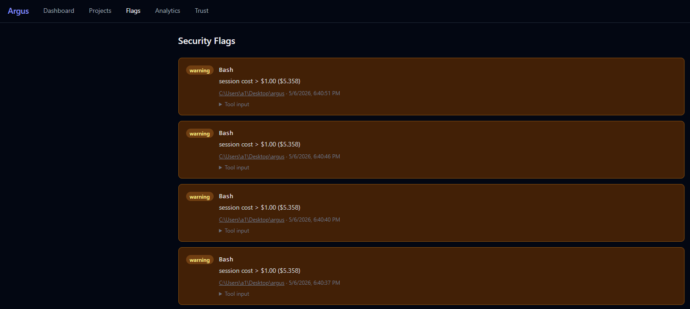
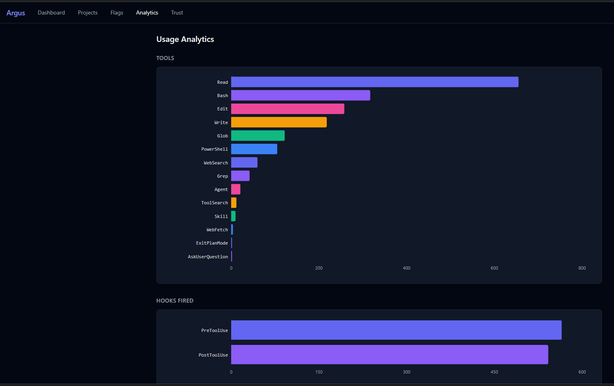
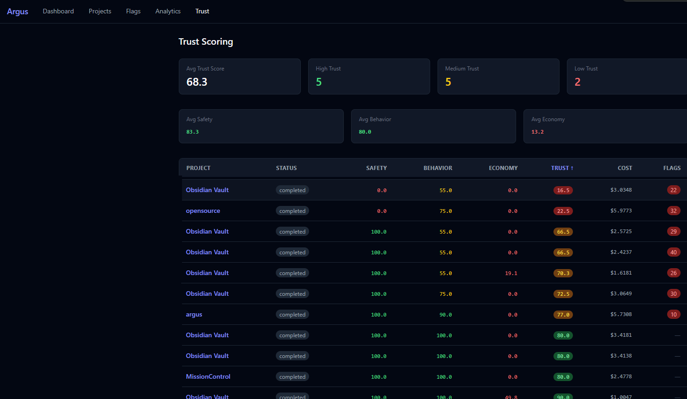
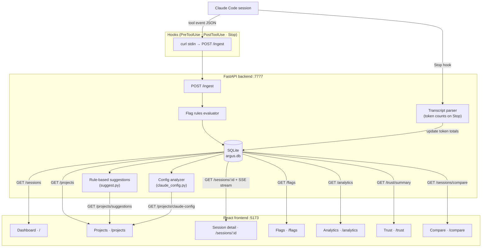

# Argus

## What is this?

You're using Claude Code to help build your project. It works fast, solves things you'd spend hours on, and drops finished code into your repo. But here's the honest question: **do you actually know what it did?** What files did it touch? What commands did it run? How much did it cost? If something went wrong, could you trace back exactly where?

Argus is a dashboard that answers these questions. Every time your AI agent takes an action — reads a file, writes code, runs bash, spawns a subagent — Argus captures it, stores it, and shows it to you in a live trace tree. You get a clear timeline of what happened, when it happened, and what it cost. You also get instant alerts on anything suspicious (like a command trying to `rm -rf` your drive, or a file being written outside your project).

It's local-first — your data never leaves your machine. No cloud uploads. No sending your code to some observability startup. Just a lightweight SQLite database on your computer and a React dashboard you visit in your browser.

Argus is built for developers using Claude Code who want to know exactly what their AI did, why, and what it cost.

## Screenshots

### Dashboard
Session list with per-session cost, token counts, trust scores, skill usage pills, and flagged event counts.



### Projects
All projects grouped from sessions, each showing aggregated cost, tokens, flags, trust score, and skills used.



### Security Flags
Every flagged event across all sessions with severity, tool, reason, and a drill-down to the full tool input.



### Usage Analytics
Horizontal bar charts for top tools, hooks fired, agent types spawned, skills invoked, and top bash commands.



### Trust Scoring
Per-session trust scores broken down into Safety, Behavior, and Economy components, with sortable columns.



## Why

Claude Code runs on your machine, touches your files, and executes commands. Existing LLM observability tools assume cloud API calls. Argus owns the local/agentic niche: the security surface is highest there, and visibility is currently zero.

## How it works



## Architecture

### Event ingestion

Claude Code fires a hook on every tool use. The hook script reads the event JSON from stdin and POSTs it to `localhost:7777/ingest`. The backend evaluates flag rules and writes to SQLite immediately.

### Data model

```
Session
├── id (Claude Code session uuid)
├── project_path
├── started_at / ended_at
├── total_cost_usd
├── status: active | completed | interrupted
├── parent_session_id  ← set for subagent sessions
└── trust_score / safety_score / behavior_score / economy_score

Event
├── id
├── session_id (FK)
├── type: tool_call | tool_result | subagent_spawn | compaction | error
├── tool_name, tool_input, tool_output (JSON)
├── agent_type, skill_name, command  ← derived semantic fields
├── input_tokens, output_tokens, cost_usd, duration_ms
├── flagged, flag_reason
└── timestamp
```

### Flag rules

| Pattern | Severity |
|---|---|
| Bash: `sudo`, `rm -rf`, `curl \| bash`, `chmod 777` | warning / critical |
| Write outside project directory | warning |
| Subagent with no parent session | info |
| Single event cost > $0.10 | warning |
| Session cost > $1.00 | warning |

### Trust scoring

Each session gets a composite trust score (0–100) computed on every ingest event:

| Component | Weight | What it measures |
|---|---|---|
| Safety | 50% | Penalty per dangerous flag triggered |
| Behavior | 30% | Flag rate, error count, subagent spawns |
| Economy | 20% | Session cost relative to $2 budget |

### Optimization suggestions

`suggest.py` runs rule-based pattern detection across a project's sessions:

- Agent type spawned in >70% of sessions → suggest a PostToolUse hook
- Skill invoked 5+ times → suggest pinning it in CLAUDE.md
- Bash command dominates (>15% of calls) → suggest a skill
- Flag fires 2+ times → suggest a PreToolUse guard
- 2+ sessions over $0.50 → suggest cost discipline
- Same file read 5+ times → suggest CLAUDE.md reference

LLM enhancement via Claude (`claude-haiku-4-5`) is wired but commented out — set `ANTHROPIC_API_KEY` and uncomment the block in `suggest.py` to enable it.

### .claude config analyzer

`claude_config.py` reads `CLAUDE.md`, `.claude/settings.json`, `~/.claude/settings.json`, and both `commands/` directories, then cross-references them against actual session behavior (hooks fired vs registered, rule violations, missing config).

### Frontend pages

```
/                      Dashboard — session list, summary stats, skill pills per session
/projects              Project cards — grouped by path, skills, cost, trust, flags
/projects/detail       Project detail — Sessions | Suggestions | .claude Config tabs
/sessions/:id          Session trace tree + live SSE feed for active sessions + Suggestions tab
/compare               Side-by-side session comparison with overlaid cost timeline
/flags                 Security feed — all flagged events with reason and severity
/analytics             Usage Analytics — bar charts for tools, hooks, agents, skills, commands
/trust                 Trust scoring — per-session Safety / Behavior / Economy breakdown
```

## Stack

| Layer | Technology |
|---|---|
| Event capture | Claude Code hooks (PreToolUse, PostToolUse, Stop) |
| Storage | SQLite via SQLModel |
| Backend | FastAPI |
| Frontend | React + Tailwind + Vite |
| Charts | Recharts |

## Quickstart

```bash
# Backend
cd backend
pip install fastapi uvicorn sqlmodel
uvicorn main:app --port 7777 --reload

# Frontend (separate terminal)
cd frontend
npm install
npm run dev
```

Then register hooks — run the installer for your platform:

```bash
# macOS / Linux
bash install.sh

# Windows (PowerShell)
.\install.ps1
```

Or register manually in `~/.claude/settings.json` — see [CLAUDE.md](CLAUDE.md) for the exact snippet.
