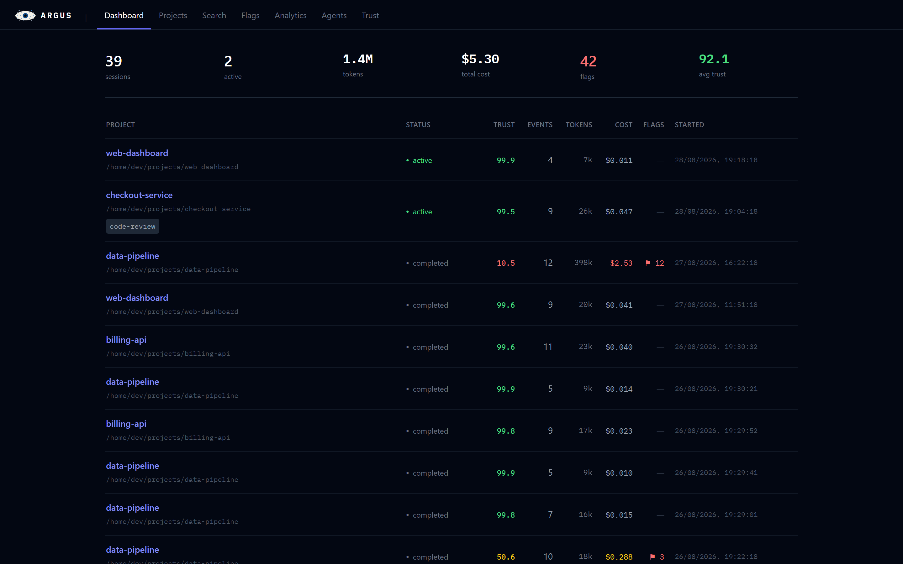
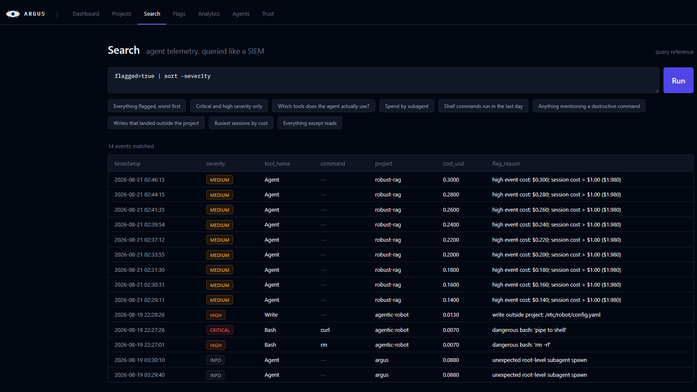
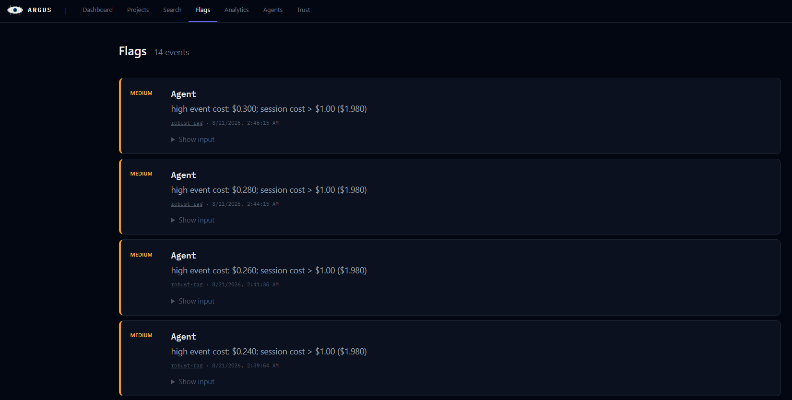
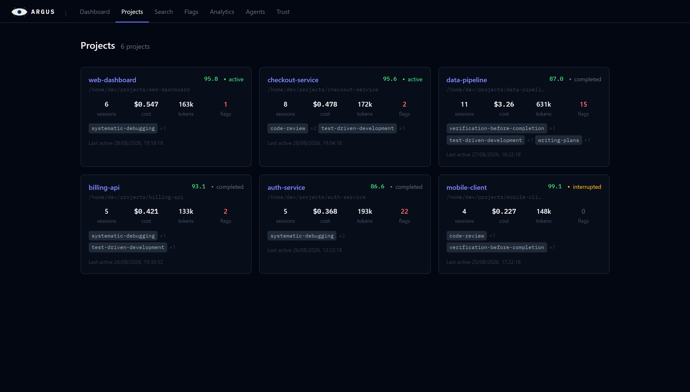
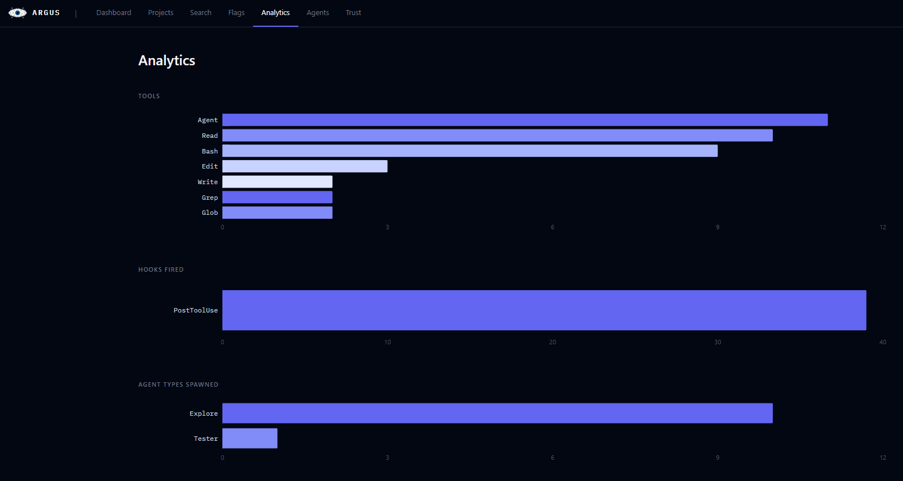
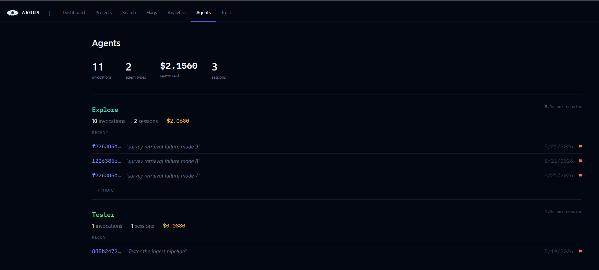
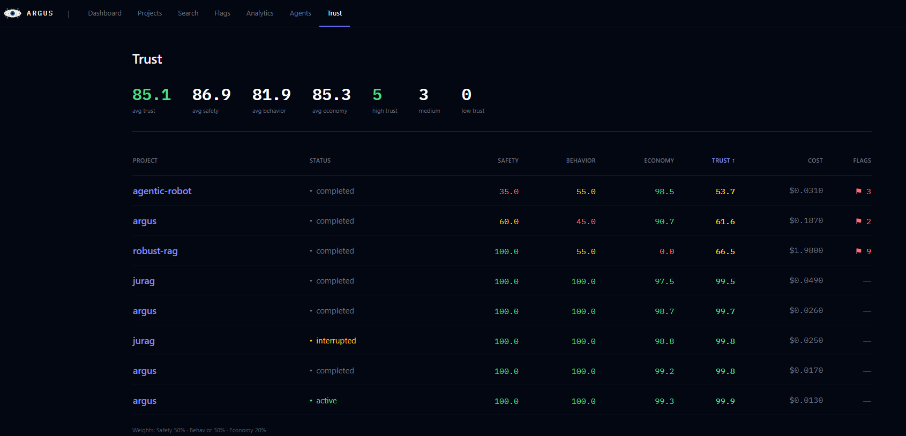
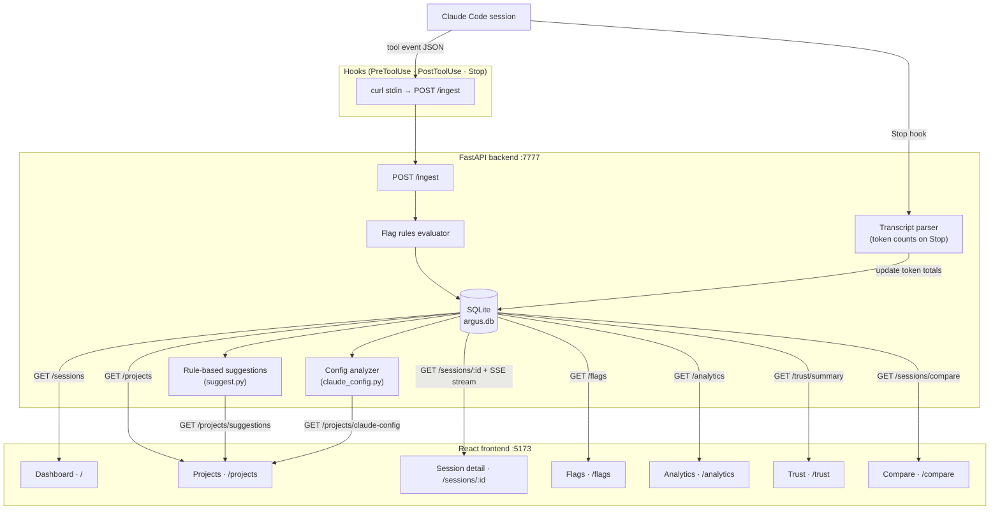

# Argus

<p align="center">
  
</p>

### 100 eyes on your AI agent.

## What is this?

You're using Claude Code to help build your project. It works fast, solves things you'd spend hours on, and drops finished code into your repo. But here's the honest question: **do you actually know what it did?** What files did it touch? What commands did it run? How much did it cost? If something went wrong, could you trace back exactly where?

Argus is a dashboard that answers these questions. Every time your AI agent takes an action — reads a file, writes code, runs bash, spawns a subagent — Argus captures it, stores it, and shows it to you in a live trace tree. You get a clear timeline of what happened, when it happened, and what it cost. You also get instant alerts on anything suspicious (like a command trying to `rm -rf` your drive, or a file being written outside your project).

It's local-first — your data never leaves your machine. No cloud uploads. No sending your code to some observability startup. Just a lightweight SQLite database on your computer and a React dashboard you visit in your browser.

Argus is built for developers using Claude Code who want to know exactly what their AI did, why, and what it cost.

## Screenshots

### Dashboard
Session list with per-session cost, token counts, trust scores, and flagged event counts.



### Search
Query agent telemetry with [AQL](#aql--the-argus-query-language), a pipe-based search language. Severity-coloured results, one-click example queries, and a built-in field reference.



### Security Flags
Every flagged event across all sessions with severity, tool, reason, and a drill-down to the full tool input.



### Projects
All projects grouped from sessions, each showing aggregated cost, tokens, flags, and trust score.



### Usage Analytics
Horizontal bar charts for top tools, hooks fired, agent types spawned, skills invoked, and top bash commands.



### Agents
Per-agent-type breakdown: total invocations, sessions spawned, spawn cost, and recent invocation prompts.



### Trust Scoring
Per-session trust scores broken down into Safety, Behavior, and Economy components, with sortable columns.



### Also in the UI
- **Session Detail** — collapsible trace tree, agent → tool call hierarchy, expandable JSON input/output, live SSE feed for active sessions
- **Project Suggestions** — LLM-enhanced optimization suggestions derived from session patterns
- **.claude Config Analyzer** — registered hooks cross-referenced against hooks actually fired
- **Session Comparison** — side-by-side metrics with an overlaid cumulative cost chart

## Why

Claude Code runs on your machine, touches your files, and executes commands. Existing LLM observability tools assume cloud API calls. Argus owns the local/agentic niche: the security surface is highest there, and visibility is currently zero.

## How it works


```mermaid
flowchart TD
    CC["Claude Code session"]

    subgraph hooks["Hooks (PreToolUse · PostToolUse · Stop)"]
        H["curl stdin → POST /ingest"]
    end

    subgraph backend["FastAPI backend :7777"]
        IN["POST /ingest"]
        FL["Flag rules evaluator"]
        DB[("SQLite\nargus.db")]
        TR["Transcript parser\n(token counts on Stop)"]
        SG["Rule-based suggestions\n(suggest.py)"]
        CC2["Config analyzer\n(claude_config.py)"]
    end

    subgraph frontend["React frontend :5173"]
        DASH["Dashboard · /"]
        PROJ["Projects · /projects"]
        SESS["Session detail · /sessions/:id"]
        FLAGS["Flags · /flags"]
        ANA["Analytics · /analytics"]
        TRUST["Trust · /trust"]
        CMP["Compare · /compare"]
    end

    CC -->|"tool event JSON"| H
    H --> IN
    IN --> FL
    FL --> DB
    CC -->|"Stop hook"| TR
    TR -->|"update token totals"| DB

    DB -->|"GET /sessions"| DASH
    DB -->|"GET /projects"| PROJ
    DB -->|"GET /sessions/:id + SSE stream"| SESS
    DB -->|"GET /flags"| FLAGS
    DB -->|"GET /analytics"| ANA
    DB -->|"GET /trust/summary"| TRUST
    DB -->|"GET /sessions/compare"| CMP
    DB --> SG
    DB --> CC2
    SG -->|"GET /projects/suggestions"| PROJ
    CC2 -->|"GET /projects/claude-config"| PROJ
```

## Architecture

### Event ingestion

Claude Code fires a hook on every tool use. The hook script reads the event JSON from stdin and POSTs it to `localhost:7777/ingest`. The backend evaluates flag rules and writes to SQLite immediately.

### Data model

```
Session
├── id (Claude Code session uuid)
├── project_path
├── started_at / ended_at
├── total_cost_usd
├── status: active | completed | interrupted
├── parent_session_id  ← set for subagent sessions
└── trust_score / safety_score / behavior_score / economy_score

Event
├── id
├── session_id (FK)
├── type: tool_call | tool_result | subagent_spawn | compaction | error
├── tool_name, tool_input, tool_output (JSON)
├── agent_type, skill_name, command  ← derived semantic fields
├── input_tokens, output_tokens, cost_usd, duration_ms
├── flagged, flag_reason
└── timestamp
```

### Flag rules

Every rule carries a severity, so the flag feed can be triaged like an alert
list rather than read as an undifferentiated pile of booleans. An event that
trips several rules reports all of them and takes the highest severity.

| Rule | Severity |
|---|---|
| Pipe to shell — `curl`/`wget` piped into `sh`/`bash`/`zsh`, with or without `sudo` | `critical` |
| `dd if=… of=/dev/…`, or a redirect to `/dev/sd*` | `critical` |
| Bash: `rm -rf` | `high` |
| Bash: `chmod 777` (including `chmod -R 777`) | `high` |
| Write or Edit outside the project directory | `high` |
| Bash: `sudo` | `medium` |
| Session cost > $1.00 | `medium` |
| Single event cost > $0.10 | `low` |
| Subagent spawned with no parent session | `info` |

Query them with [AQL](#aql--the-argus-query-language): `severity>=high | table timestamp tool_name flag_reason`.

### Trust scoring

Each session gets a composite trust score (0–100) computed on every ingest event:

| Component | Weight | What it measures |
|---|---|---|
| Safety | 50% | Penalty per dangerous flag triggered |
| Behavior | 30% | Flag rate, error count, subagent spawns |
| Economy | 20% | Session cost relative to $2 budget |

### Optimization suggestions

`suggest.py` runs rule-based pattern detection across a project's sessions:

- Agent type spawned in >70% of sessions → suggest a PostToolUse hook
- Skill invoked 5+ times → suggest pinning it in CLAUDE.md
- Bash command dominates (>15% of calls) → suggest a skill
- Flag fires 2+ times → suggest a PreToolUse guard
- 2+ sessions over $0.50 → suggest cost discipline
- Same file read 5+ times → suggest CLAUDE.md reference

LLM enhancement via OpenRouter (`baidu/cobuddy:free`) is live — copy `.env.example` to `.env` and set `OPENROUTER_API_KEY` to enable it. Falls back to rule-based suggestions silently if the key is absent.

### .claude config analyzer

`claude_config.py` reads `CLAUDE.md`, `.claude/settings.json`, `~/.claude/settings.json`, and both `commands/` directories, then cross-references them against actual session behavior (hooks fired vs registered, rule violations, missing config).

### Frontend pages

```
/                      Dashboard — session list, summary stats, skill pills per session
/projects              Project cards — grouped by path, skills, cost, trust, flags
/projects/detail       Project detail — Sessions | Suggestions | .claude Config tabs
/sessions/:id          Session trace tree + live SSE feed for active sessions + Suggestions tab
/compare               Side-by-side session comparison with overlaid cost timeline
/search                AQL search — query events by field, severity, time; stats and tables
/flags                 Security feed — all flagged events with reason and severity
/analytics             Usage Analytics — bar charts for tools, hooks, agents, skills, commands
/agents                Agent activity — per-agent-type invocation counts, sessions, and recent prompts
/trust                 Trust scoring — per-session Safety / Behavior / Economy breakdown
```

## AQL — the Argus Query Language

Agent telemetry deserves to be searched, not just browsed. AQL is a pipe-based
query language in the shape of Splunk's SPL, but with the vocabulary of agent
sessions: tools, subagents, skills, token cost, and flag reasons.

```
tool=Bash severity>=high | table timestamp command flag_reason
tool=Agent | stats sum(cost_usd) as spend, count by agent_type | sort -spend
"rm -rf" earliest=-24h
NOT tool=Read | stats count by tool
| stats sum(cost_usd) as cost by session | sort -cost | head 10
```

### Search terms

A query is a list of terms, ANDed together, optionally followed by pipeline
commands.

| Form | Example | Meaning |
|---|---|---|
| `field=value` | `tool=Bash` | equals (case-insensitive) |
| `field!=value` | `tool!=Read` | not equals |
| `field>value` | `cost>0.10` | numeric / severity / time comparison (`>`, `<`, `>=`, `<=`) |
| `field~value` | `reason~outside` | contains |
| `field=val*` | `command=git*` | wildcard, `*` anywhere in the value |
| `bareword` | `npm` | full-text across tool name, command, input, output, flag reason |
| `"quoted phrase"` | `"rm -rf build"` | full-text, spaces preserved |
| `NOT term` | `NOT tool=Read` | negation |
| `flagged=true` | | booleans take `true` / `false` |

`OR` is not supported yet; terms are ANDed.

### Fields

Canonical names come from the event row. These aliases are shorthand:

| Alias | Field |
|---|---|
| `tool` | `tool_name` |
| `agent` | `agent_type` |
| `skill` | `skill_name` |
| `session` | `session_id` |
| `cost` | `cost_usd` |
| `reason`, `rule` | `flag_reason` |
| `project` | project directory name |
| `status` | parent session status |
| `event` | `type` |
| `hook` | `hook_event_name` |

Also queryable: `severity`, `flagged`, `timestamp`, `command`, `tool_input`,
`tool_output`, `input_tokens`, `output_tokens`, `duration_ms`, `trust_score`.

### Severity

`info` < `low` < `medium` < `high` < `critical`, compared **by rank, not
alphabetically** — `severity>=high` matches high and critical, and
`sort -severity` puts critical on top. Severity is set by whichever rule fired:
pipe-to-shell is `critical`, a write outside the project is `high`, cost rules
are `low`/`medium`.

### Time

Time is a filter like any other. Relative offsets accept `s`, `m`, `h`, `d`:

```
earliest=-24h              events from the last day
earliest=-30m latest=-5m   a window
earliest=2026-08-01        ISO timestamps work too
```

### Pipeline commands

| Command | Example | Notes |
|---|---|---|
| `stats` | `stats count by tool` | `count`, `sum(f)`, `avg(f)`, `min(f)`, `max(f)`, `dc(f)`; rename with `as`; group with `by` (multiple fields allowed) |
| `table` | `table timestamp tool_name cost_usd` | pick columns (alias: `fields`) |
| `sort` | `sort -cost_usd` | `-` prefix for descending; works on `as` aliases |
| `head` | `head 20` | first N rows |
| `dedup` | `dedup session` | first row per distinct value |
| `where` | `stats count by tool \| where count>5` | filter after aggregation |

### Worked examples

```bash
# Everything flagged, worst first
flagged=true | sort -severity

# Only the serious stuff, as a table
severity>=high | table timestamp severity tool_name command flag_reason

# Which tools does the agent actually reach for?
| stats count by tool

# Where is the money going?
tool=Agent | stats sum(cost_usd) as spend, count by agent_type | sort -spend

# Shell commands run in the last day
tool=Bash earliest=-24h | table timestamp command project

# Sessions ranked by spend
| stats sum(cost_usd) as cost, count by session | sort -cost | head 10

# Writes that landed outside the project directory
reason~"outside project" | table timestamp tool_input project
```

### API

```
GET /api/search?q=<query>&limit=200
GET /api/search/help            # fields, operators, commands, examples
```

A malformed query returns `400` with a readable message
(`unknown command 'frobnicate' (available: stats, table, sort, head, dedup, where)`).

Queries are executed in Python over rows fetched from the database — never
compiled into SQL — so a user-supplied query string has no injection surface.

## Stack

| Layer | Technology |
|---|---|
| Event capture | Claude Code hooks (PreToolUse, PostToolUse, Stop) |
| Storage | SQLite via SQLModel |
| Backend | FastAPI |
| Frontend | React + Tailwind + Vite |
| Charts | Recharts |

## Quickstart

```bash
# One process serves the API and the UI
cd frontend && npm install && npm run build
cd ../backend && pip install -r requirements.txt
uvicorn main:app --port 7777
```

Open <http://localhost:7777>.

For frontend development, run Vite separately for hot reload — it proxies the
API to port 7777:

```bash
cd frontend && npm run dev      # http://localhost:3000
```

### Try it without your own data

`demo.db` is a synthetic database — invented sessions that exercise every view
and every flag rule. Nothing in it comes from a real session.

```bash
python scripts/make_demo_db.py
cd backend && ARGUS_DB=../demo.db uvicorn main:app --port 7788
```

For LLM-enhanced suggestions, copy `.env.example` to `.env` and set `OPENROUTER_API_KEY` (free account at openrouter.ai). The backend loads it automatically on startup.

Then register hooks — run the installer for your platform:

```bash
# macOS / Linux
bash install.sh

# Windows (PowerShell)
.\install.ps1
```

Or register manually in `~/.claude/settings.json` — see [CLAUDE.md](CLAUDE.md) for the exact snippet.
